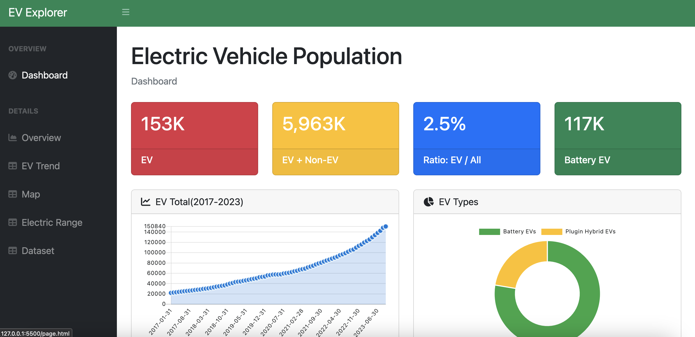

[](https://classroom.github.com/a/aIBftyMV)

# Project: Electric Vehicle Data Visualization

**Team EV Explorer**

# Team Members

- Hongyi Wang, hongyiwa@usc.edu, [dp3why](https://github.com/dp3why)
- Yuchong Chen, yuchongc@usc.edu, [icharleschen](https://github.com/icharleschen)
- Yingkai Zhong, yingkaiz@usc.edu, [yingkai2](https://github.com/yingkai2)
- Nan Jiang, njiang72@usc.edu, [JennyJiangN](https://github.com/JennyJiangN)

# Project Summary

The electric vehicle (EV) industry has witnessed unprecedented growth, reshaping the automotive technology landscape. This project presents a comprehensive data visualization project that addresses the informational needs of key stakeholders in the EV sector in the Washington State: investors, potential EV purchasers, and policymakers. Our project offers a detailed analysis of the EV market, including market share, brand performance, and geographical distribution of EVs. Through a user-friendly dashboard, stakeholders can access vital data. The project also provides insights into the growth of EV adoption, the comparative analysis of Battery Electric Vehicles (BEVs) and Plug-in Hybrid Electric Vehicles (PHEVs), and the distribution of electric range, enabling informed decision-making for investors, purchasers, and policymakers.



# Artifacts

## Demonstration

The at the [index.html](/index.html), open a new terminal and run

```bash
npm install
```

After the installation, run

```bash
npm run serve
```

The website will be hosted at `localhost`.

## Paper

Paper [Overleaf Read-only](https://www.overleaf.com/read/fcdhjvzqcrmb#b317d5) | [PDF](./paper/Electric_Vehicle_Data_Visualization.pdf)

## YouTube Video

Demonstration video [LINK](https://www.youtube.com/watch?v=tOTDemot6EI)

## Presentation PDF

Presentation Slides [LINK](https://docs.google.com/presentation/d/14xLt4UdVtzzFpS2tfKl-eP6dpqLAz0yZVL1IDtKbRMc/edit?usp=sharing) | [PDF](./presentation/Presentation-EV%20Explorer.pdf)

# Other Project Documentation

- [Screenshots](./screenshots/)
- [Wireframe Design](./wireframes/)
- [Visualization Wheel](./visualization_wheel/)

# Contributions

| Name          | Responsibilities                                                    |
| ------------- | ------------------------------------------------------------------- |
| Hongyi Wang   | Landing Page, Dashboard, Choropleth, Dot Map, Tables, and Bootstrap |
| Yuchong Chen  | Data Acquisition, Data Preprocessing, Histogram, and format Report  |
| Yingkai Zhong | Description, Storytelling, and EV Selling by Type Bar Chart         |
| Nan Jiang     | Data Preprocessing and Line Chart                                   |

# Notes

- [Raw Datasets](./data_raw/)
- [Preprocessed Scripts](./preprocessing/)
- [Preprocessed Datasets](./data/)
